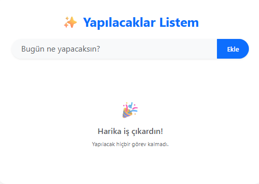
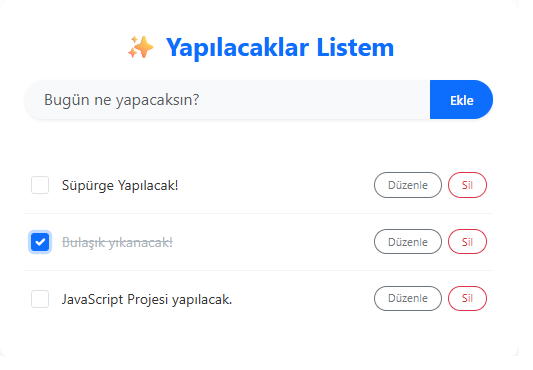
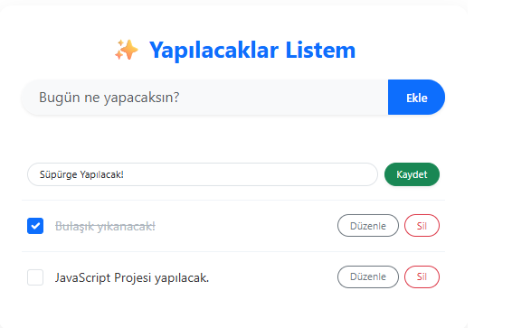

# Angular TODO App

Bu proje, bir Görev Yönetim (TODO) uygulamasıdır. Kullanıcıların günlük görevlerini ekleyebileceği, listeleyebileceği, güncelleyebileceği ve silebileceği (CRUD) temel işlevleri barındırır.

## 🚀 Proje Çıktıları ve Özellikler
- **Modern Framework:** Angular
- **Veri Kalıcılığı:** LocalStorage kullanılarak tarayıcı yenilendiğinde verilerin kaybolmaması sağlandı.
- **Tasarım:** Bootstrap 5 ve özel CSS ile modern, responsive (uyumlu) ve kullanıcı dostu arayüz kuruldu.
- **İşlevler:** Ekle, Listele, Güncelle, Sil ve Tamamlandı işaretleme.

## 📁 Klasör Yapısı
Proje, yönergelere uygun olarak aşağıdaki modüler yapıda kurgulanmıştır:
- `src/app/Pages`: Uygulama sayfaları
- `src/app/Interfaces`: Veri modelleri ve tip tanımlamaları
- `src/app/Components`: Alt bileşenler

## 📸 Ekran Görüntüsü

## 🛠️ Kurulum ve Çalıştırma
Projeyi bilgisayarınızda çalıştırmak için aşağıdaki adımları izleyebilirsiniz:

1. Repoyu klonlayın: `git clone https://github.com/ufukabravaci/angular-todo-app`
2. Proje dizinine girin: `cd angular-todo-app`
3. Bağımlılıkları yükleyin: `npm install`
4. Projeyi başlatın: `ng serve`
5. Tarayıcınızda `http://localhost:4200/` adresine gidin.

## 🌐 Canlı Önizleme
Projenin çalışan canlı haline bu bağlantıdan ulaşabilirsiniz: **[Netlify Linki Buraya Gelecek]**